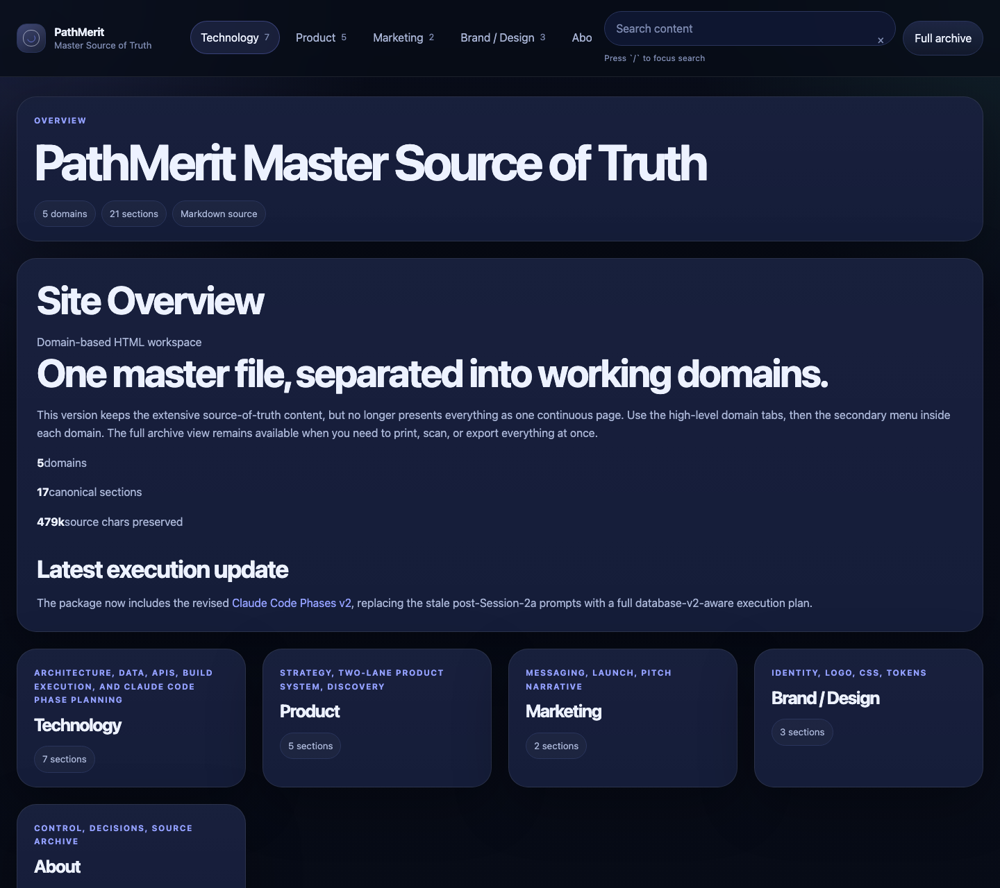
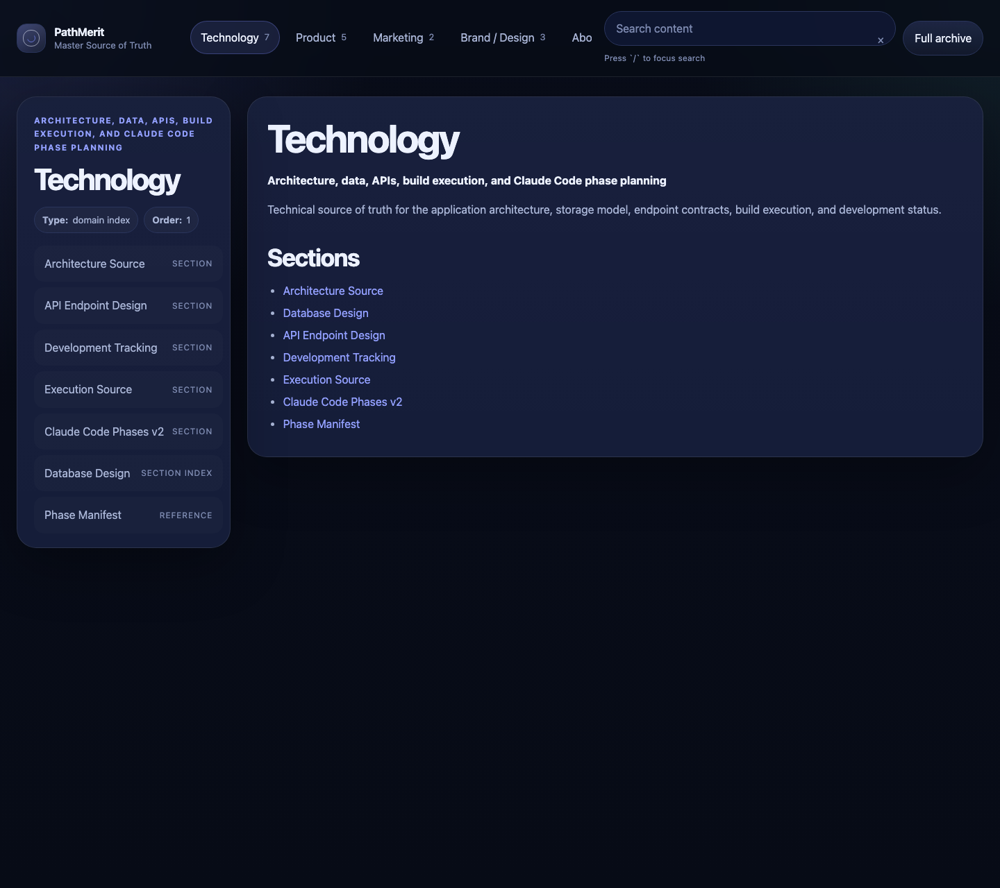
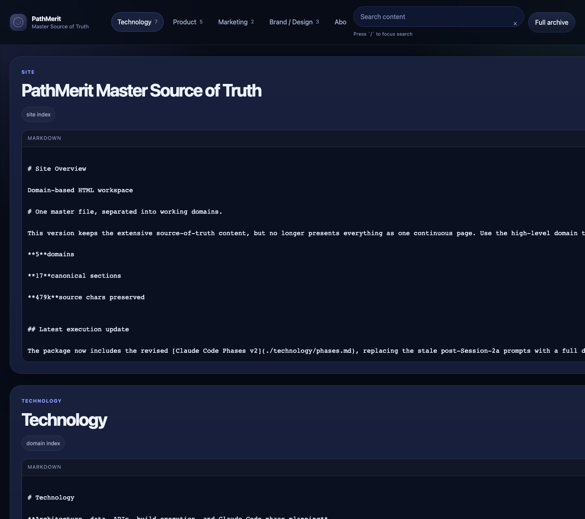

# SourceFrame

A reusable Next.js + TypeScript template for documentation sites and product source-of-truth libraries.

SourceFrame pairs a polished content-first app shell with Markdown-driven navigation, search, and archive views. The template ships with a real sample content tree, but the app is designed to be swapped over by replacing [`/content`](./content) and editing [`site.config.ts`](./site.config.ts).

This template expects Node.js 24.

## Included

- App Router + strict TypeScript
- Build-time Markdown loading and frontmatter validation
- Generated domain tabs and section navigation from content metadata
- Client-side search over titles, headings, and body text
- Full archive view
- Markdown rendering for GFM tables, fenced code blocks, Mermaid, heading anchors, details/summary, and raw HTML from trusted content, plus a literal-text Source Archive exception for `content/about/sources.md`
- Responsive and print-friendly styling
- A documented authoring workflow, deployment guide, and screenshot capture script

## Screenshots

Captured from the local app after the template polish pass. These images are generated from the live app and live in [`public/screenshots`](./public/screenshots):







## Quick start

```bash
node --version
pnpm install
pnpm dev
```

Then open `http://localhost:3000`.

## Scripts

- `pnpm dev` - start the Next.js dev server
- `pnpm format` - write Prettier formatting
- `pnpm format:check` - verify Prettier formatting
- `pnpm lint` - run ESLint
- `pnpm generate:content` - regenerate the checked-in content manifests and migration report
- `pnpm screenshots` - capture template preview images into `public/screenshots`
- `pnpm typegen` - generate Next.js route types without a full build
- `pnpm typecheck` - generate Next.js route types and then run the TypeScript compiler in no-emit mode
- `pnpm build` - create a production build
- `pnpm test` - run content loader tests
- `pnpm validate:content` - validate the real content tree

## Start A New Project

1. Copy the repository into a new workspace.
2. Copy [`templates/site.config.example.ts`](./templates/site.config.example.ts) to `site.config.ts` and edit the values for your project.
3. If you want a focused starting point, copy one of the starter packs from [`templates/starter-packs`](./templates/starter-packs) instead of beginning from the raw sample tree.
4. Replace the files in [`/content`](./content) with your own Markdown, or start from the example tree in [`templates/content-example`](./templates/content-example).
5. Keep frontmatter on every content file.
6. Use `content/index.md` for the site overview.
7. Use one `index.md` file per top-level domain folder, such as `content/technology/index.md`.
8. Use nested Markdown files for sections and specialized content types.
9. Read [`docs/content-authoring.md`](./docs/content-authoring.md) before adding new content.
10. Read [`docs/vercel-deployment.md`](./docs/vercel-deployment.md) before deploying.
11. Run `pnpm build` before publishing so frontmatter and routing errors are caught early.

## Content Rules

- Every content file must include frontmatter.
- `title` is required.
- Domain pages should use `type: "domain-index"`.
- Regular pages should set `domain`, `section`, `type`, and `order`.
- Database table pages should use `type: "database-table"` and include `table_name`.
- Keep cross-links as relative Markdown links. The renderer rewrites them to app routes automatically.

## Project Structure

- [`app`](./app) - routes and layouts
- [`components`](./components) - reusable UI and Markdown components
- [`docs`](./docs) - content authoring and deployment guides
- [`content`](./content) - Markdown source of truth
- [`lib`](./lib) - content loading, registry building, and Markdown helpers
- [`public/screenshots`](./public/screenshots) - captured preview images for the template
- [`templates`](./templates) - starter config, content examples, and frontmatter references
- [`templates/starter-packs`](./templates/starter-packs) - copyable starter configs and content roots for common documentation styles
- [`styles`](./styles) - global CSS and design tokens

## Notes For Maintainers

- The navigation tree is generated from frontmatter and file paths.
- Search is client-side and uses the build-time registry.
- The app shell is intentionally generic so you can swap content without touching layout code.
- The source archive page is intentionally large and should be left as Markdown unless you have a strong reason to split it further.
- `content/about/sources.md` is rendered as literal source text so the archive stays auditable and cannot be reinterpreted as normal Markdown.
- Mark template-only docs with `visibility: "internal"` when they should stay in the repo but be excluded from the public migration manifest.
- Run `pnpm generate:content` after changing `/content` if you want to refresh the checked-in manifests in `/generated`.
- Run `pnpm screenshots` after starting the app locally if you want fresh preview images in [`public/screenshots`](./public/screenshots).
